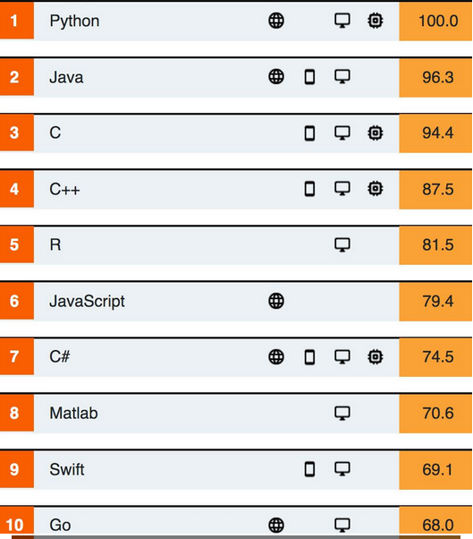

# Introduction:
Il est rare de trouver un langage de programmation comme python qui n'a cessée de faire parler de lui ces dernières années et plus encore de séduire de plus en plus de gens allant des niobites jusqu'au programmeurs certifiés.

Python est un langage de programmation *__interprété__*, multi-paradigme et multi-plateformes. Il favorise la programmation impérative structurée, fonctionnelle et orientée objet. Il est doté d'un typage dynamique fort, d'une gestion automatique de la mémoire et d'un système de gestion d'exceptions.

Il s'est doté de plusieurs packages et modules qui ont étendus son champs d'application de telle façon qu'on peut dire aujourd'hui qu'il n'est limité que par l'imagination et 'l'innovation du programmeur.

Dans le domaine du calcul scientifique, Python n'a cessé de conquérir de nouvelle terrain allant du calcul symbolique a  l'intelligence artificielle et plus encore. L’élève ingénieur d’aujourd’hui doit impérativement maîtriser un tel potentiel et l'exploiter en sa faveur dans les différents projets qu'il entament d’investir lors de sa formation.

Dans cette optique vient cette offre de formation gratuite en langage de programmation Python destinée principalement aux étudiants de l'ENSA de Fes quelque soit leur niveau scolaire tant qu'ils sont motivés par le désire d'apprendre et la volonté de s'ouvrir sur de nouvelles perspectives et horizons.  

# Intitulée de la formation:

### *Apprendre la programmation scientifique avec Python 3*

# Durée de la formation:
 Cette formation s’entendra sur 15 semaines a raison de deux heurs par semaines et se terminera par un projet de validation des acquis réalisée par l’étudiant sur la base de son propre choix.

# Programme de la formation
1. Mise en place de l'Environnement de programmation:
   - Miniconda et ``Python 3``
   - Environnement de développement:
      - Python shell.
      - Python Shell Interactif: IPython.
      - Jupyter:
        + Jupyter QtConsole
        + Jupyter notebook
        + Jupyter lab
     - Python IDE:
        + Spyder
        + Vscode
        + Pycharm,
        + vim
        + atom
2. Bases de ``Python`` 1:
   - Nombres, variables, Comparaison et logique
   - Objets de Python 1: ``String``
   - Objets de Python 2: ``Listes`` et ``Tuples``
   - Contrôle de flux dans ``Python``
   - Boucles et itérateurs:
   - Fonctions dans ``Python``:
   - Entrées/Sorties dans ``python``:
      - Formatage des données.
      - Manipulation des fichiers (lecture/écriture).
3. Bases de ``Python`` 2:
   - Erreurs et exceptions
   - Objets de ``Python`` 3:
      - Listes utilisées comme pile et file.
      - Dictionnaires et Ensembles
      - Compréhension: (Listes, Ensembles et dictionnaires)
   - Interfaces avec l'OS
   - Modules et packages
4. Python numérique ou ``NumPy``:
   - Méthode de base pour la manipulation des tableaux.
   - Lire et écrire un tableau dans un fichier
   - Méthodes statistiques
   - Polynômes
   - Algèbre linéaire
   - Échantillonnage aléatoire
   - Analyse de Fourier
5. Plots 1: ``Matplotlib``
   - Réaliser des graphes de différents types
   - Interactivité avec ``ipywidgets``
   - Personnalisation et raffinement des graphes.
   - Annotation des graphes
   - Graphes 3D
6. Plots 2: ``Plotly``
   - Lines, scatters and other types of Plots
   - Personnalisation et refinement des graphes.
   - Annotation des graphes
7. Exemples de calcul scientifique avec ``SciPy``.
   - Fonctions speciales
   - Integration des EDOs.
   - Interpolation
   - Ajustement de courbes (Data fitting) et recherche numériques des racines de fonctions.

# Validation de la formation:
#### La dite formation sera validée par un projet réalisé par chaque étudiant. 
